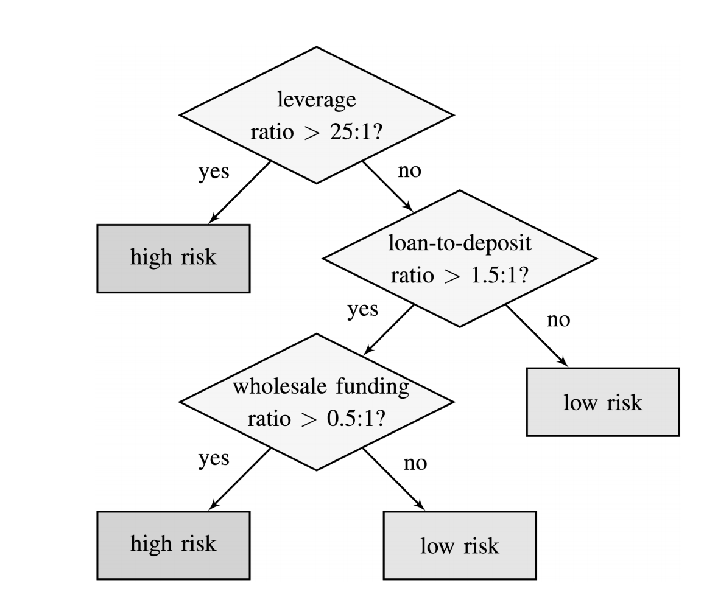
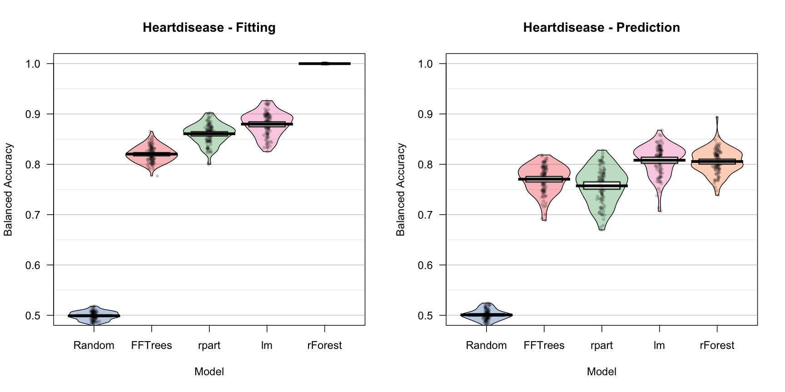
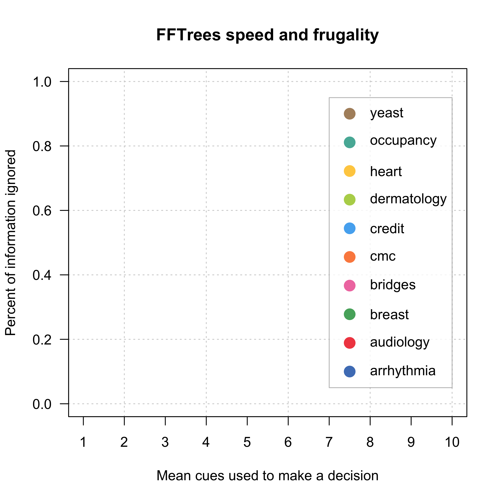
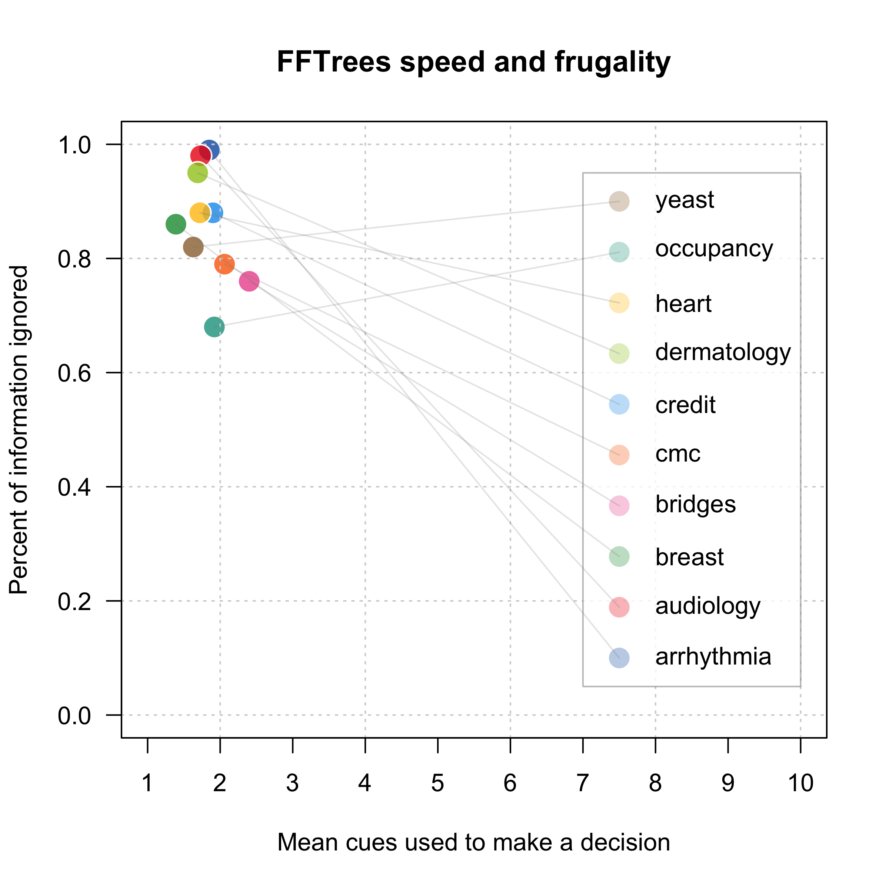
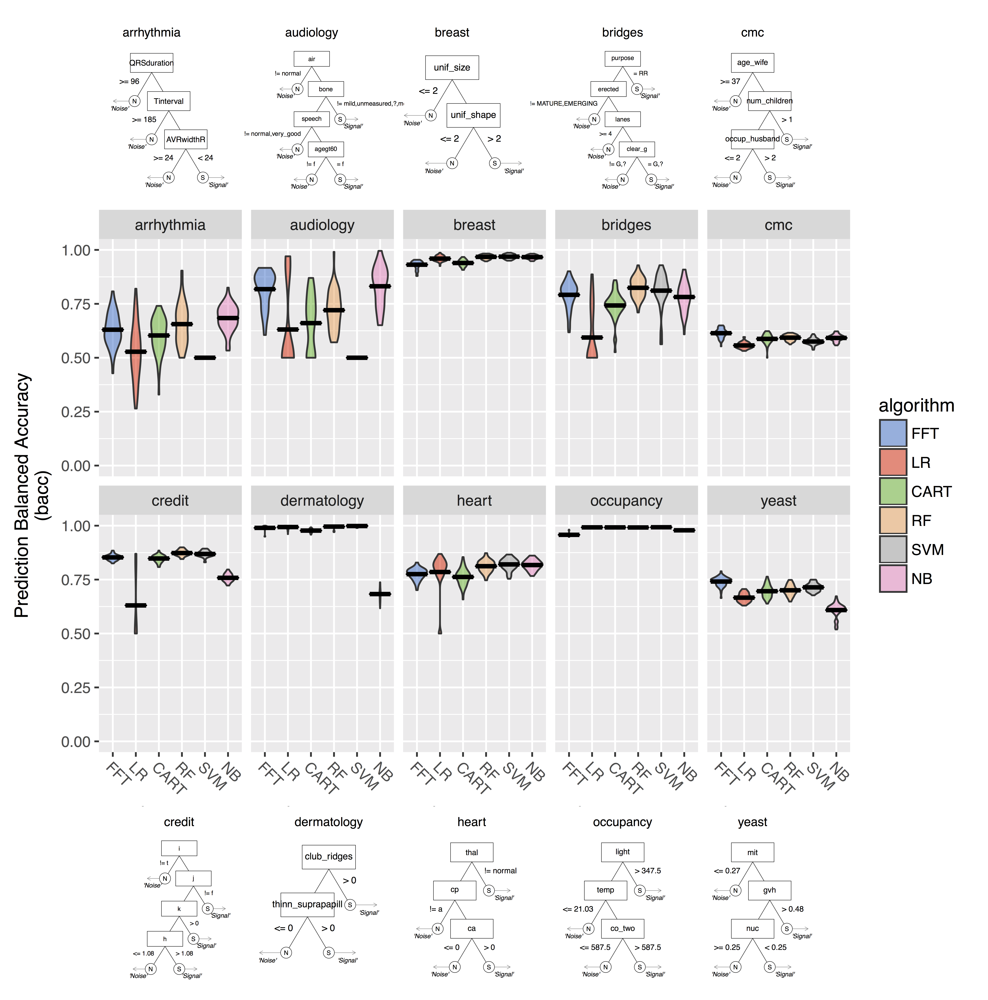
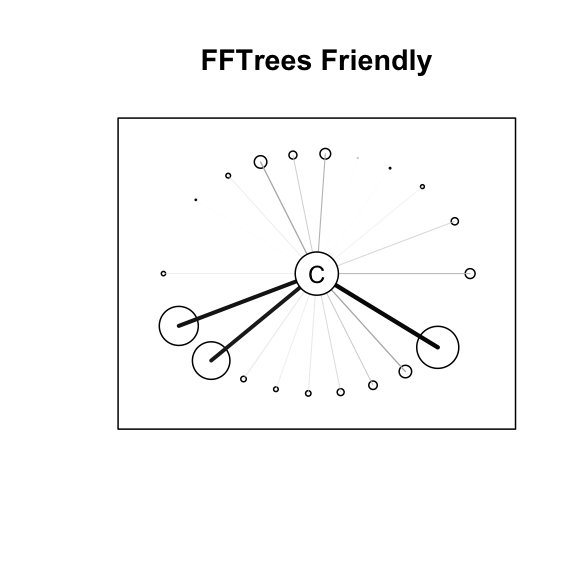
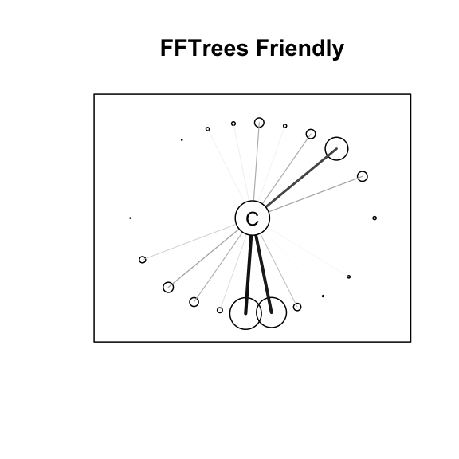
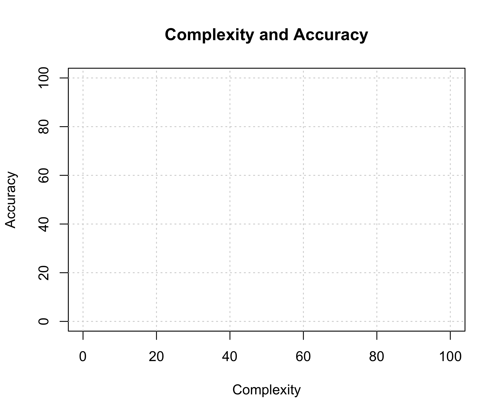
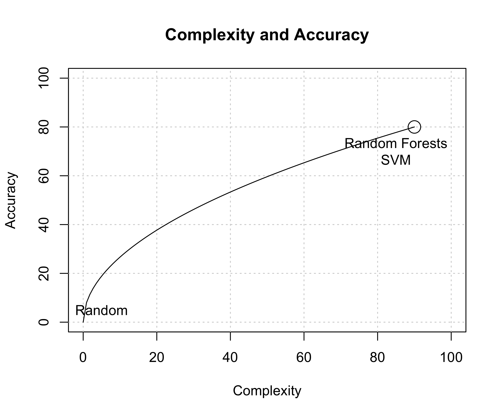

---&twocol

***=left
### Cook County Hospital, 1996


- 250,000 patients per year, Not enough space, Complete chaos

***=right


"As the city’s principal public hospital, Cook County was the place of last resort for the hundreds of thousands of Chicagoans without health insurance. Resources were stretched to the limit. The hospital’s cavernous wards were built for another century. There were no private rooms, and patients were separated by flimsy plywood dividers. There was no cafeteria or private telephone—just a payphone for everyone at the end of the hall. In one possibly apocryphal story, doctors once trained a homeless man to do routine lab tests because there was no one else available." Malcolm Gladwell, Blink.


--- &twocol

*** =left

### Heart attacks (?)

- **Coronary care bed** ($2K a night + 3 day stay) or **Regular bed**
- Goal: Send true heart attacks to the coronary care, others to a normal bed.

### Multiple, uncertain measures

- Electrocardiogram (ECG), Blood pressure, Stethoscope, How long? During exercise? History? Cholesterol? Drugs?

### Problem

- Doctors make individual, idiosyncratic decisions.
- Very high false positive rate -> High costs, low space.

*** =right


---

### Classic prediction problem

- Many cues (aka predictors, features), binary criterion


### Options

- Doctor's intuition
- Algorithm


--- &twocol

## Decision Trees

***=left

#### Definition

- A decision tree is a set of sequential, heirchical, non-compensatory rules.
- A fast and frugal tree (FFT) is a decision tree with exactly two branches from each node, where one, or both, of the branches are exit branches (Martignon et al., 2008)

#### Descriptive Uses

- Inference (Gigerenzer & Goldstein, 1996)
- Judge's bailing decisions (Dhami, 2003)

#### Prescriptive Uses

- Terrorist attacks (Garcia, 2016)
- Bank failure (Aikman et al., 2014; Neth et al., 2014)


***=right



Neth et al. (2014). "Homo heuristicus in the financial world".


---&twocol

## Emergency Room Solution: a fast and frugal tree (FFT)

***=left

- A fast and frugal decision tree (FFT) developed by Lee Goldman.
- Doctor's intuition accuracy: 75-90%, Decision tree accuracy: 95%
- Tree had far fewer false-positives and substantial cost savings
- One of the great successs stories of an algorithm used in practice.

***=right


---

## Why use a simple algorithm like an FFT?

| | Complex| Simple |
|:---------|:----|:-----|
|     Example|    Regression, Random Forests, Bayes|Fast and Frugal Tree (FFT)|
|     Information Requirements|    High|Low     |
| Cost of use | High | Low |
|     Search|    Comprehensive|Sequential     |
|     Speed|    Slow|Fast     |
| Transparency, ease of use| Medium or Low| High|
| Accuracy | Depends | Depends |

---&twocol
## FFTrees

***=left

- Problem: While there are many packages for creating non-frugal decision trees (like `rpart()`), no such tool exists for fast and frugal trees.

- Solution: `FFTrees` An easy-to-use R package to create, visualize, and implement fast and frugal decision trees.

<br>
<div style="text-align:left"><font size="1"> Phillips et al. (under review). FFTrees: An R package to create, visualize, and implement fast and frugal decision trees</font></div>


***=right


---

## Heart Disease Data


| age| sex|cp | trestbps| chol| fbs|restecg     | thalach| exang| oldpeak|slope | ca|thal   | diagnosis|
|---:|---:|:--|--------:|----:|---:|:-----------|-------:|-----:|-------:|:-----|--:|:------|---------:|
|  63|   1|ta |      145|  233|   1|hypertrophy |     150|     0|     2.3|down  |  0|fd     |         0|
|  67|   1|a  |      160|  286|   0|hypertrophy |     108|     1|     1.5|flat  |  3|normal |         1|
|  67|   1|a  |      120|  229|   0|hypertrophy |     129|     1|     2.6|flat  |  2|rd     |         1|
|  37|   1|np |      130|  250|   0|normal      |     187|     0|     3.5|down  |  0|normal |         0|
|  41|   0|aa |      130|  204|   0|hypertrophy |     172|     0|     1.4|up    |  0|normal |         0|
|  56|   1|aa |      120|  236|   0|normal      |     178|     0|     0.8|up    |  0|normal |         0|

- Goal: Predict diagnosis as a function of cues.
- Regression: 6 significant cues (sex, cp, thalach, exang, oldpeak, ca)


---

## 3 Steps to creating FFTs with FFTrees


```r
# Step 0: Install FFTrees (v.1.2.0)
install.packages("FFTrees")

# Step 1: Load the package
library("FFTrees")

# Step 2: Create an fft decision model with FFTrees
heart.fft <- FFTrees(formula = diagnosis ~.,
                       data = heartdisease)
```

## Demo


---&twocol

***=left

## How trees are built with FFTrees

1. For each cue, calculate a decision threshold that maximizes accuracy *ignoring all other cues*.
2. Rank order cues by their maximum accuracy.
3. Select the top N (i.e., 4) most accurate cues
    - If any lower levels contain less than X\% (e.g., 10\%) of the data, remove them.
4. Select the exit structure with the highest accuracy.

***=right


---

### Prediction model competition

- 100 50/50 cross validation simulations on the heartdisease dataset.


---

### Prediction model competition


---

### Prediction model competition


---

### Prediction model competition




---&twocol
## Efficiency

***=left

- FFTs are very cheap to implement

- Heart disease data
    - Regression: $300
    - rpart: > $100
    - Heart disease FFT: $75.91

***=right


| cue| cost | description|values |
|:------|:---|:----|:-----|
|     `thal`| $102 | thallium scintigraphy, a nuclear imaging test that measures blood flow|normal (n), fixed defect (fd), reversible defect (rd)     |
|     `cp`| $1 |    Chest pain type| Typical (ta), atypical (aa), non-anginal pain (np), asymptomatic (a)     |
|     `ca`| $101 | Number of major vessels colored by flourosopy, an x-ray imaging tool|0, 1, 2 or 3 |


---&twocol

***=left

## Generalizing FFTrees

- The `FFTrees` package can be used with any dataset with a binary criterion.
- Simulation: 10 diverse datasets taken from the UCI Machine Learning Database.
- FFTrees vs. regression, Naive Bayes, Random Forests and more

### How well can a simple fast and frugal tree predict data?  

***=right


---


```r
mushrooms.fft <- FFTrees(poisonous ~., data = mushrooms)
```


---


```r
breast.fft <- FFTrees(diagnosis ~ ., data = breastcancer)
```


--- .class #id 
## Speed and frugality





--- .class #id 
## Speed and frugality





--- .class #id 
## Prediction accuracy across 10 dasets


--- .class #id 




---

### When should I consider an FFT?


---&twocol

***=left

### FFTrees Unfriendly Data

- Many cues, weak validity, ind errors




***=right

### FFTrees Friendly Data

- Few cues with high validity, dep errors.



---&twocol

***=left

### Next steps for the FFTrees package

1. Incorporate numerical cue costs in algorithm.
2. Re-write FFT growing code in C++ for speed.
    - Consider simulation based fitting methods.
3. Quantify changes in data over time given a single tree.
    - Can notify user when there is an important change in the data.

***=right


---&twocol
## Collaborators

***=left

- Wolfgang Gaissmaier (University of Konstanz)
- Hansjoerg Neth  (University of Konstanz)
- Jan Woike  (MPI for Human Development)

***=right


--- .class #id 

### FFTrees

#### My Links

- This presentation: [https://ndphillips.github.io/ZurichPWC28April2017](https://ndphillips.github.io/ZurichPWC28April2017)
- Website: https://ndphillips.github.io
- Email: Nathaniel.D.Phillips.is@gmail.com

#### Packages

- FFTrees: `install.packages("FFTrees")`
- yarrr: `install.packages("yarrr")`


--- &twocol

*** =left
## FFTrees algorithm

1. Calculate a decision threshold `t` for each cue that maximizes the cue’s balanced accuracy `bacc` in training.

2. Rank cues in order of their maximum balanced accuracy -- select the top N cues. 

3. Creates all possible `2^{N−1}` trees with these cues, using all exit structures.

*** =right


---&twocol

## Complexity vs. Simplicity

***=left

<br>


***=right

<br>


---



---


---


---



---


